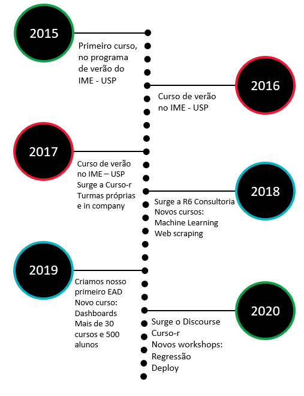
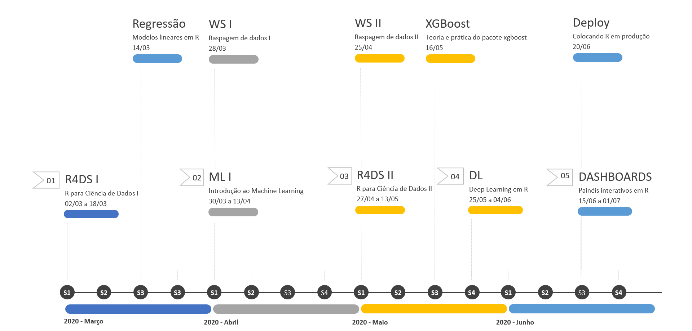
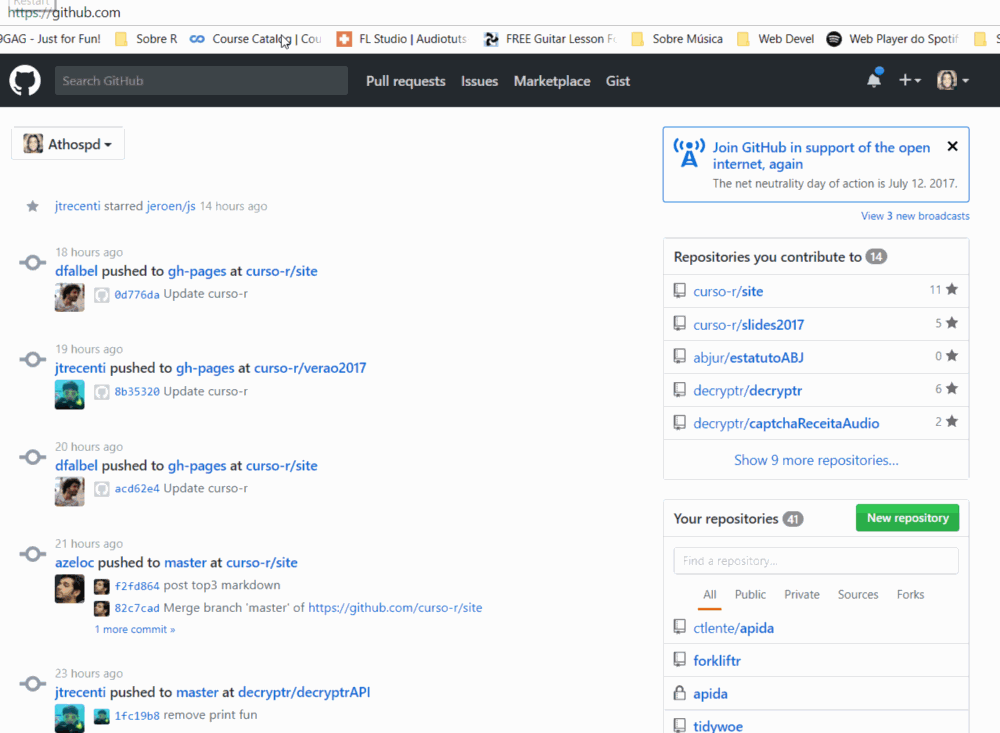
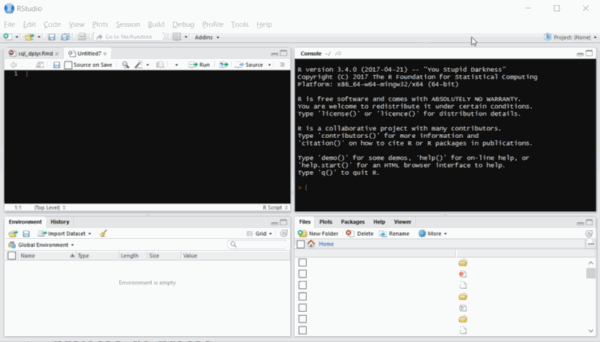
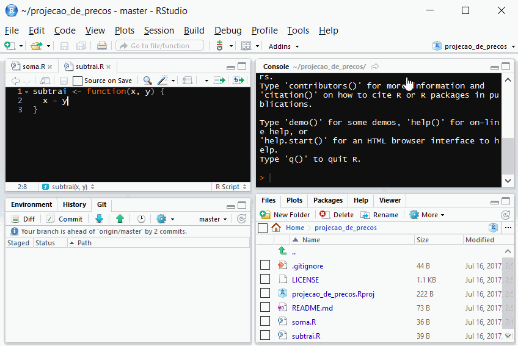

# Sobre a Curso-R

```{r, echo=FALSE, fig.align='center'}
knitr::include_graphics("img/professores.png")
```

---

# Linha do tempo

```{r, echo=FALSE, fig.align='center', dpi=135}

```

---

# Nossos cursos

```{r, echo=FALSE, fig.align='center'}

```

---

# Este curso

📌 Ambientação ao Git e Github

📌 Manipulação avançada de dados

📌 Introdução à programação funcional

📌 Visualização avançada de dados

📌 Criação de pacotes

📌 Comunicação de resultados com dashboards (Shiny)

---

# Resultados Esperados

Você sairá do curso sabendo como usar o R e o RStudio para:

✅ usar o Github para compartilhar o desenvolvimento dos seus projetos;

✅ fazer operações avançadas de manipulação dados, em especial envolvendo texto e datas;

✅ construir scripts eficientes para resolver problemas complexos utilizando programação funcional;

✅ fazer gráficos complexos usando o pacote ggplot2;

✅ contruir pacotes de R;

✅ construir dashboards em Shiny.

---

# Metodologia MUY (Me, Us, You)

1. (eu) Conceitos/explicações
1. (nós) Exemplo
1. (você!) Exercício

Vamos fazer ao todo 24 MUYs durante o curso!

---

# MUYs

### 27/04

1. Estruturando projetos
1. A vida zen com `usethis::`
1. Usando Git e Github

### 29/04

1. Setup da aula, exercício de onboard
1. `readr::`, `readxl::`,
1. `dplyr::` 5 verbos
1. `dplyr::` collect, postgres
1. `dplyr::` pivotagem

---

# MUYs

### 04/05

1. `dplyr::` joins
1. `dplyr::` nest/unnest
1. `dplyr::` separate/unite
1. `dplyr::` curly-curly

### 06/05

1. `lubridate::` dmy, hms
1. `stringr::` funções sem regex
1. `stringr::` funções com regex
1. `purrr::` map, map_dfr

---

# MUYs


### 11/05

1. `ggplot2::` gramática e exemplos
1. `ggplot2::` forcats
1. `htmlwidgets::` plotly e highcharter
1. `htmlwidgets::` tabelas (opções) e reactable

### 13/05

1. `flexdashboard::` inputs
1. `flexdashboard::` gráfico 1, gráfico 2
1. `flexdashboard::` tabela 1, tabela 2
1. `flexdashboard::` mapa 1, customizado

---

# Dia do case

- Todos serão livres para fazer um app shiny da maneira que quiserem
- No final da aula, teremos apresentações dos aplicativos desenvolvidos!
- Exemplo de case: https://rseis.shinyapps.io/r4ds2

---

# Dados

Vamos trabalhar com diversas fontes de dados abertos. A primeira será dados abertos de ocorrências criminais. Vamos limpar esses dados, criar visualizações e fazer um *dashboard* interativo 


---
class: center, middle, inverse

# Organização de projetos

---

# Organização de projetos

- Existem diversas formas de organizar projetos de ciência de dados.
- Todas essas formas têm vantagens e desvantagens.

[imagem-pessoa-confusa]

---

# O maior problema: a coesão

- Uma forma de organizar projetos pode ser excelente para um tipo de projeto específico, mas ruim para outros.
- Isso sugeriria que, para cada projeto, deveríamos ter uma estrutura diferente de arquivos.
- No entanto, isso não é verdade.
- Mais importante do que discutir qual é a estrutura ideal para um caso específico, é escolher um __protocolo__ para seguir em todos os projetos.
- Isso tira da nossa mente a necessidade de pensar sobre a estrutura, para que possamos colocar nosso foco na análise de dados.
- Em alguns projetos, esse protocolo será ineficiente, é verdade. 
- Mesmo assim, no longo prazo os benefícios superam os custos.

[img pacote]

--

### Será que existe protocolo a ser seguido em projetos de R?

---
class: center, inverse, middle

Sim.

---

# Package driven development

- Neste curso, vamos trabalhar com projetos desenvolvidos através de __pacotes__. 
- Um pacote do R nada mais é do que uma forma específica de organizar seus código, seguindo o protocolo descrito pela R Foundation.
- Vamos focar nas partes mais importantes, sem dar muitos detalhes sobre questões específicas.
- Utilizaremos os pacotes `usethis` e `devtools` para nos ajudar.

[img pacote]

---

# Estrutura básica de um pacote

## Essenciais:

- `DESCRIPTION`: É o arquivo que define o nome do seu pacote
- `R/`: Aqui ficam suas funções desenvolvidas em R.

--

## Dados:

- `data/`: Aqui ficam suas bases de dados finais.
- `data-raw/`: Aqui ficam seus scripts de arrumação e bases de dados intermediárias (70% do seu trabalho)

--

## Comunicação:

- `docs/`: Sites, relatórios, dashboards estáticos.
- `vignettes/`: Documentação do pacote.

---

# É difícil?

## Sim.

- No início, vai parecer que é muita informação
- Existem várias regrinhas que a princípio não fazem sentido, mas ficarão mais claras à medida que vamos trabalhando.

---

# Vamos ao R!

[gato programador]

---

# Estrutura do pacote criado

- `R/`: pasta onde colocaremos nossas funções.
- `.gitignore`: tem a ver com o Git. Veremos mais para frente.
- `projeto.Rproj`: projeto do RStudio.
- `DESCRIPTION`: forma estruturada de descrever o pacote e suas dependências.
- `.Rbuildignore` e `NAMESPACE`: Cuida de coisas mais avançadas que não discutiremos no curso.

---

# Funções principais do usethis

- `usethis::create_package()`: cria seu pacote. Nomes não podem ter espaço, traço, underline e não podem começar com números.
- `usethis::use_mit_license()`: adiciona uma licença MIT ao seu pacote. 
- `usethis::use_readme_rmd()`: cria um `README` para seu pacote, no formato RMarkdown.
- `usethis::use_data()`: cria uma

---

# Funções principais do devtools

- `devtools::load_all()`: carrega todas as funções da pasta `R/` e as bases salvas na pasta `data/`.
- `devtools::install()`: instala o pacote que você criou. Utilizar somente quando seu pacote estiver pronto.

---

# Vamos ao R!

[gato programador]

---

Exercício 01: Criando seu primeiro pacote

1. Utilize `usethis::create_package()` para criar seu primeiro pacote

---

# Por quê na pasta R/ só pode ter funções?

- Uma função é responsável por executar uma tarefa pequena, mas muito bem.
- Quando trabalhamos com funções, nossas operações ficam mais confiáveis.
- A ideia da pasta `R/` é guardar em um local comum tudo aquilo que nós utilizamos como ferramenta interna para nossas análises, bem como aquilo que queremos que outras pessoas possam usar no futuro.

# Qual a diferença entre `R/` e `data-raw/`?

### data-raw

- A pasta `data-raw/` é sua caixa de areia.
- Apesar de existirem formas razoáveis de organizar seus pacotes aqui, nessa parte você será livre

### R/

- Já a pasta `R/` conterá funções bem organizadas e documentadas.
- Por exemplo, uma função que ajusta um modelo estatístico, outra que arruma um texto de um jeito patronizado, ou uma que contém seu tema customizado do `ggplot` 
- Não pode carregar outros pacotes com `library()`. Usar operador `::`.

---

# Pacotes e GitHub

- No nosso caso, pacote e repositório serão sinônimos
- Pacotes do R e o GitHub são melhores amigos.
- O grande cupido dessa amizade colorida é o `usethis`.
- Único cuidado a ser tomado: bases de dados grandes demais.
    - Se uma base de dados tem mais do que 50Mb de tamanho, ela não deveria estar no seu repositório


---
class: center, middle, inverse

# Git e GitHub

---

# Git e Github

Seguiremos o excelente livro [Happy Git with R](https://happygitwithr.com/), feito pela Jenny Bryan. Se tiver dúvidas, pode seguir por lá.

O que veremos

- Motivação
- Criar um repositório
- Conceitos de *clone*, *stage*, *commit*, *pull*, *push*
- Fluxo de trabalho
- Principais cuidados

Requisitos (Aula Zero)

- Uma conta no GitHub
- Git instalado na sua máquina
- RStudio instalado

--

**Se você ainda não tiver isso, faça agora. Se tiver dificuldades, chame o monitor.**

---

# Por quê Git?


```{r echo=FALSE, out.width="40%", fig.align='center'}
knitr::include_graphics("img/git.png")
```


- Git é um **sistema de versionamento**.
- Foi criado em 2005 por Linus Torvalds, autor do sistema Linux.
- É capaz de guardar o histórico de alterações de todos os arquivos dentro de uma pasta, que chamamos de repositório.
- Funciona como o "*Track changes*" do word, mas muito melhor e mais organizado.
- Torna-se importante à medida que seu trabalho é __colaborativo__.


### Git é o software que você instala no computador.


---

# Por quê GitHub?

```{r echo=FALSE, out.width="40%", fig.align='center'}
knitr::include_graphics("img/github.png")
```


- GitHub é um site onde você coloca e compartilha repositórios Git.
- É utilizado por milhões de pessoas para desenvolver projetos de código aberto ou fechado.
- Muito útil para colaborar com outros programadores em projetos de ciência de dados.
- Forma segura de guardar os códigos que você desenvolve.
- Existem alternativas, como [GitLab](https://about.gitlab.com/) e [BitBucket](https://bitbucket.org/product).


### GitHub é o site que você acessa na internet.

---

# É difícil?

### Sim.

- O Git tem uma série de comandos esquisitos e raramente é intuitivo, mesmo para programadores experientes.
- Na prática, sempre que você tiver problemas precisará perguntar ao Google ou consultar no Happy Git with R.

### Vantagem: com o RStudio é super fácil de fazer as tarefas comuns.

- Vamos seguir o tutorial [deste post da Curso-R](https://www.curso-r.com/blog/2017-07-17-rstudio-e-github/)

---

# Fluxo de trabalho

```{r echo=FALSE, fig.align='center'}
knitr::include_graphics("img/fluxo_github_rstudio.png")
```

---

# Passo 1: Criando repositório

```{r echo=FALSE, out.width="80%", fig.align='center'}

```

---

# Passo 2: Criando projeto

```{r echo=FALSE, out.width="90%", fig.align='center'}

```

---

# Passo 2.5: Configure seu nome de usuário

Configure seu usuário do Git:

```{r eval=FALSE}
usethis::use_git_config(
  # Pode ser seu nome mesmo, não precisa ser o nickname
  user.name = "NOME", 
  # precisa ser o que está vinculado à sua conta do github
  user.email = "seu@email.com"
)
```


---

# Passo 3: Stage & Commit

```{r echo=FALSE, out.width="80%", fig.align='center'}
knitr::include_graphics("img/passo_3_commit_1.gif")
```

__Observação__: O ato de clicar no item é o passo de Stage.

---

# Passo 4: Push

```{r, echo=FALSE, out.width="90%", fig.align='center'}

```

---

# Passo 5: Pull

```{r, echo=FALSE, out.width="90%", fig.align='center'}
knitr::include_graphics("img/passo_5_pull.gif")
```


---

# Resumo

### 1. Repositório: Criar repositório do projeto no Github
### 2. .Rproj: Crie um projeto no RStudio clonando o repositório
### 3. Commit: Edite e "Commite" as mudanças no código
### 4. Push: Suba os commits para o Github
### 5. Pull: Baixe o estado atual do projeto

---

# Simplificando tudo: usethis

- O pacote `usethis` ajuda com todo o fluxo de desenvolvimento em R

- Ele pode ajudar com criar projetos, repositórios, dependências e muito mais

- Conseguimos fazer todos os passos já vistos sem sair do R

```{r, warning=FALSE, eval=FALSE}
library(usethis)
create_project("MeuProjeto")
```

- O comando acima cria um novo projeto R no caminho indicado entre aspas

- Você pode passar um caminho complexo como `~/Downloads/MeuProjeto` e tudo
funcionará como esperado

---

# Adicionando Git e GitHub

- Depois que o seu projeto estiver pronto, transforme ele em uma pasta com
controle de versão

```{r, eval=FALSE}
use_git()
```

- Rodando o comando acima na pasta do projeto (a nova aba do RStudio que
apareceu) você adiciona controle de versão

- Você receberá algumas instruções para seguir, mas está tudo certo

```{r, eval=FALSE}
use_github()
```

- O comando acima sincroniza a pasta com o GitHub

- Mais uma vez, você receberá algumas instruções, mas lembre-se apenas de
selecionar o método de autenticação HTTPS

---

# Exercício 01

Escolha o seu método preferido para criar um projeto com conexão no GitHub:
pela interface do próprio site ou pelo R. Siga todos os passos e não se esqueça
de configurar seu usuário com `use_git_config()`!

1. Crie um repositório
2. Clone o repositório em um projeto do RStudio
3. Crie um script em R e adicione uma função `soma_um()`
4. Commit & Push

OU

1. Crie um projeto
2. Crie um script em R e adicione uma função `soma_um()`
3. Adicione conexão com o git e com o GitHub
4. Commit & Push


